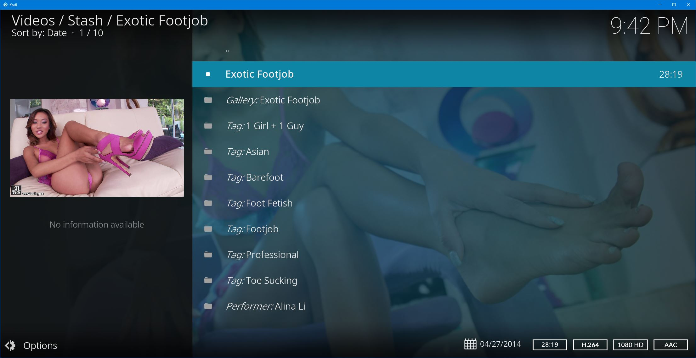

# Kodi Stash Addon

This addon for Kodi lets you browse your [Stash](https://stashapp.cc/) library, watch scenes, and view gallery pictures,
all on the big screen!

## Features

- Navigate through your Stash library from multiple facets:
  _Scenes_, _Movies_, _Performers_, _Galleries_, and _Tags_ (_Studios_ and _Markers_ coming soon!).
  
  For _Scenes_, you can play from the beginning, play from a _Marker_, or browse to the associated
  _Galleries_, _Performers_ and _Tags_.
  
  For _Movies_, you can browse to the associated _Scenes_.

  For _Performers_, you can browse to the associated _Scenes_ and _Galleries_.

  For _Galleries_, you can view the images or browse to the associated _Scenes_ and _Performers_.
  
- Playback of all Kodi-supported video formats -- no transcode required.

- Scene fanart is randomly selected from associated Galleries (if any).

- Optionally only display _Organized_ content.

## Installation

## Known Issues

- Galleries are listed when the addon is accessed via the _Video Addons_ section, but gallery images don't display.
  
  Likewise for Scenes under the _Picture Addons_ section.

- Some GraphQL queries could be better optimized.

